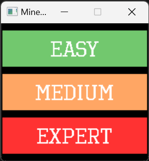
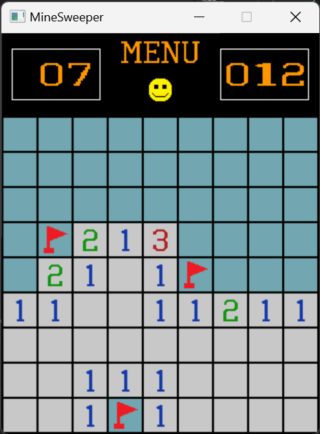
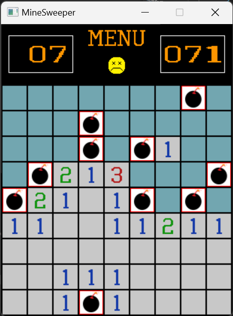
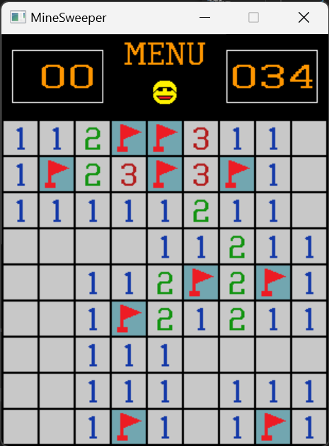

# MineSweeper

Recreation of the popular game MineSweeper Using SDL2 and C++.

Game Screen

Lost Screen

Win SCreen

## Features
- Selection of three difficulty levels (Easy, Medium, Expert)
- Flags and and timer
- Reset level and back to menu button

## Installation
- Download all files
- Edit `CMakeLists.txt` and change `SDL2_PATH` on line 19, to the path where you have SDL2 libraries. ( WINDOWS )
- Build with CMake

## External libraries
- SDL2 and SDL2_TTF for rendering